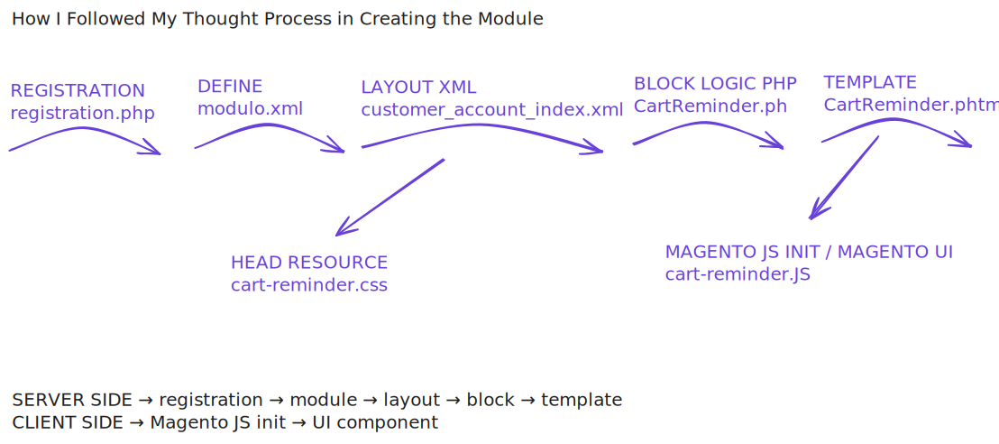

# Cart Reminder Module for Magento 2

This repository contains a Magento 2 module that displays a cart reminder popup on the frontend for customers. The module identifies products from a specific category in the cart and presents them in a styled overlay, allowing users to either proceed to checkout or close the popup.


---

## Description

The `Mauro_CartReminder` module retrieves all visible items from the customer's cart and filters them based on a predefined category ID (14 in this example). It displays up to three products with their name, image, and link to the product page. The module is integrated into the frontend using Magento UI Components and Knockout.js for dynamic data binding, and it includes responsive CSS to ensure proper display across devices.



---

## Magento Concepts Covered

- **Blocks:** `Mauro\CartReminder\Block\CartReminder` handles cart data retrieval, filtering products by category, and preparing data for frontend rendering.
- **Templates:** `cart_reminder.phtml` renders the popup HTML and initializes the Knockout.js UI Component with filtered items.
- **UI Components:** The frontend logic is implemented as a UI Component (`Mauro_CartReminder/js/cart-reminder.js`) with observable arrays for dynamic binding of cart items.
- **Layout Integration:** `customer_account_index.xml` adds the block to the customer account page and includes the required CSS file.
- **CSS Styling:** `cart-reminder.css` defines the appearance, layout, animations, and responsive behavior of the popup.
- **Module Registration:** `registration.php` and `module.xml` register the module with Magento and define its version.
- **Image Helper:** `Magento\Catalog\Helper\Image` is used in the block to generate product images for display in the popup.

#### How do I see it outside of the code?

Block → PHP logic; decides what to render<br/>
Template → Displays stuff, no logic<br/>
UI Component → Makes it dynamic in the browser<br/>
Layout → Builds the page structure<br/>
CSS Styling → Makes it look good …<br/>
Module Registration → Officially registers the module<br/>
Helper → The friend who never fails you<br/>

---

## Installation

### Prerequisites

This module was developed on Magento 2.4.8 .  
It is recommended to use a markshust/docker-magento ( https://github.com/markshust/docker-magento ).

### Installation Steps

Navigate to your Magento project root directory.
Create the module directory and clone the repository:

```bash
    mkdir -p app/code/Mauro/CartReminder
    git clone https://github.com/maruccimauro/magento-2-CartReminder-Module.git src/app/code/Mauro/CartReminder
```

### Enable the module:

```bash
bin/magento module:enable Mauro_CartReminder
php bin/magento setup:upgrade
php bin/magento setup:static-content:deploy -f
php bin/magento cache:clean
php bin/magento cache:flush
```

---

## Module Structure

```
Mauro_CartReminder/
├── Block/
│   └── CartReminder.php
├── etc/
│   ├── module.xml
├── registration.php
├── view/
│   └── frontend/
│       ├── web/
│       │   ├── css/
│       │   │   └── cart-reminder.css
│       │   └── js/
│       │       └── cart-reminder.js
│       ├── templates/
│       │   └── cart_reminder.phtml
│       └── layout/
│           └── customer_account_index.xml
```

---

## Author

Author: Mauro Marucci
